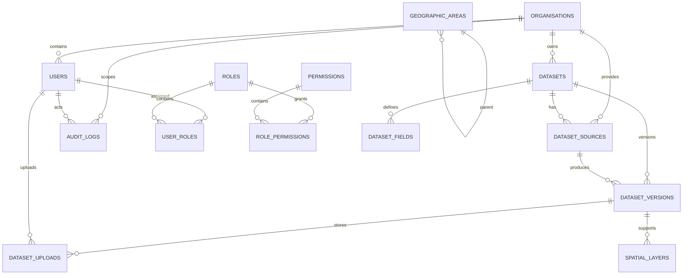

# CRAM Initial ERD - Milestone 4

```mermaid
erDiagram
    ORGANISATIONS ||--o{ USERS : contains
    ORGANISATIONS ||--o{ DATASETS : owns
    ORGANISATIONS ||--o{ DATASET_SOURCES : provides
    ORGANISATIONS ||--o{ AUDIT_LOGS : scopes
    USERS ||--o{ USER_ROLES : assigned
    ROLES ||--o{ USER_ROLES : contains
    ROLES ||--o{ ROLE_PERMISSIONS : grants
    PERMISSIONS ||--o{ ROLE_PERMISSIONS : contains
    DATASETS ||--o{ DATASET_SOURCES : has
    DATASETS ||--o{ DATASET_VERSIONS : versions
    DATASETS ||--o{ DATASET_FIELDS : defines
    DATASET_SOURCES ||--o{ DATASET_VERSIONS : produces
    DATASET_VERSIONS ||--o{ DATASET_UPLOADS : stores
    USERS ||--o{ DATASET_UPLOADS : uploads
    DATASET_VERSIONS ||--o{ SPATIAL_LAYERS : supports
    GEOGRAPHIC_AREAS ||--o{ GEOGRAPHIC_AREAS : parent
    USERS ||--o{ AUDIT_LOGS : acts
```

This ERD deliberately excludes all later-roadmap climate, notification, citizen-reporting, dashboard, reporting, and authentication-token entities.
